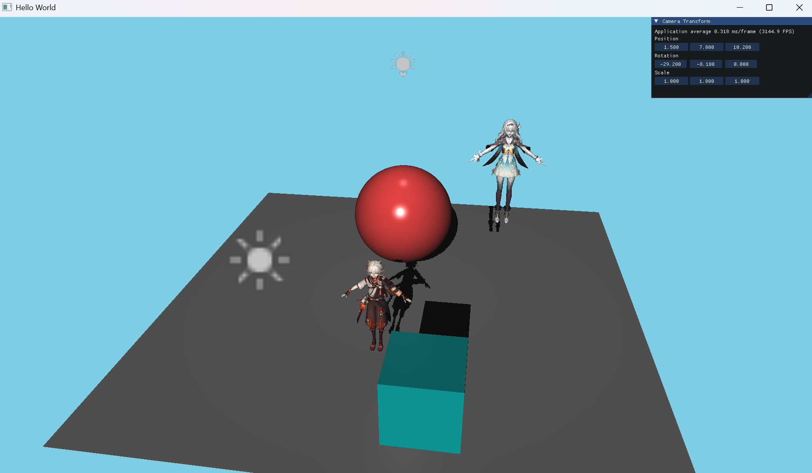
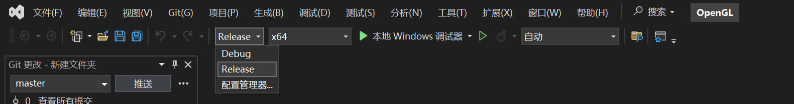
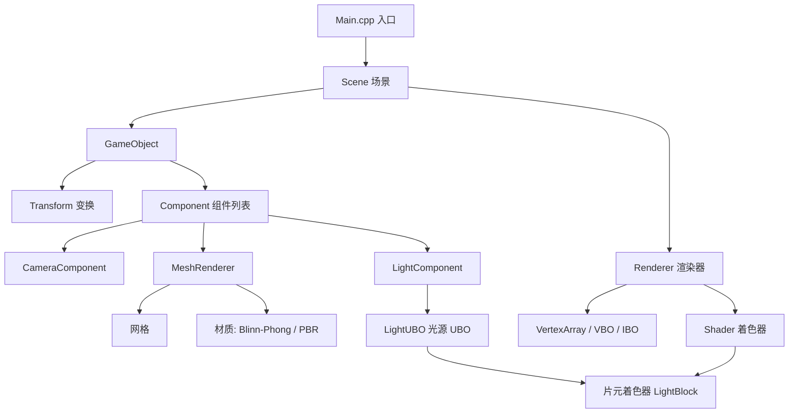

# OpenGL 手动搭建渲染引擎

一个基于 **OpenGL 4.2 Core** 手写实现的轻量级 3D 渲染引擎项目（不使用现成引擎，纯手动管理 OpenGL 状态与资源），使用 **C++20** 编写。项目采用类似 Unity 的 **GameObject-Component（ECS 变体）** 架构，支持场景管理、多种材质、多光源（UBO 批量上传）、assimp 模型加载以及 ImGui 调试界面。



---

## 功能特性

- 1. **GameObject-Component 架构**
  - `GameObject` 支持父子层级、Transform（位置 / 旋转 / 缩放）
  - 基于模板 + `std::derived_from` 约束的组件添加 / 查询（`AddComponent<T>` / `GetComponent<T>`）
  - `Component` 生命周期钩子：`OnAttach`、`OnUpdate`、`OnRender`
- 2. **场景管理（Scene）**
  - 创建 / 销毁 / 按名称查找 GameObject
  - 快捷创建相机、立方体、平面、球体、方向光、点光源
  - 支持 `assimp` 加载外部模型（如 FBX）
- 3. **材质系统（Material）**
  - 抽象基类 `Material`，派生 `BlinnPhongMaterial`（Blinn-Phong 光照）、`PBRMaterial`（PBR 光照）
  - 材质模板方法可传入任意参数组合
- 4. **多光源系统（Light）**
  - 方向光（Directional Light）、点光源（Point Light）
  - 通过 **UBO（Uniform Buffer Object）** 批量上传最多 `MAXLIGHTS = 16` 个光源，单次 `glBufferSubData` 高效更新
- 5. **ImGui 调试界面**
  - 实时显示 FPS / 每帧耗时
  - 摄像机位置、旋转（Pitch / Yaw / Roll）、缩放的拖拽控制
- 6. **调试友好**
  - `GLCall` / `GLClearError` / `GLPrintError` + `ASSERT` 宏，OpenGL 错误自动定位到文件与行号并触发断点
- 7. **纯手写资源管线**：`VertexBuffer` / `IndexBuffer` / `VertexArray` / `Shader` / `Texture` 封装
- 8. **模型加载（assimp）**：加载 FBX 等外部模型，支持多子网格拆分与贴图自动加载（拼接模型相对路径解决 assimp 相对路径问题）
- 9. **光源图标 Billboard（公告牌）**：光源标记图标四边形始终面向相机，区分方向光 / 点光源，视觉上直观定位光源
- 10. **硬阴影（Shadow Mapping）**：方向光阴影映射，先渲染深度 Pass 生成阴影贴图，主 Pass 采样阴影贴图实现实时阴影

---

## 技术栈与依赖

| 依赖 | 用途 | 说明 |
| --- | --- | --- |
| [GLFW](https://www.glfw.org/) | 窗口与输入 | `Dependencies/GLFW` |
| [GLEW](https://glew.sourceforge.net/) | OpenGL 扩展加载 | 静态链接（`GLEW_STATIC`），需最先 `#include` |
| [assimp](https://github.com/assimp/assimp) | 模型加载 | `Dependencies/assimp` |
| [glm](https://github.com/g-truc/glm) | 数学库（矩阵 / 向量） | `Scripts/vendor/glm`（头文件库） |
| [ImGui](https://github.com/ocornut/imgui) | 调试 UI | `Scripts/vendor/imgui` |
| [stb_image](https://github.com/nothings/stb) | 纹理加载 | `Scripts/vendor/stb_image` |

- **语言 / 标准**：C++20
- **图形 API**：OpenGL 4.2 Core（顶点着色器 `#version 330`，片元着色器 `#version 420`）
- **编译器**：MSVC（Visual Studio 2022，`cl.exe`）

---

## 项目结构

```
OpenGL(Manually)/
├── OpenGL.sln                      # 根级解决方案
├── Dependencies/                   # 第三方库（GLFW / GLEW / assimp 的头文件与静态库）
├── OpenGL/
│   ├── OpenGL.sln / OpenGL.vcxproj # VS 工程文件
│   ├── build/                      # 手动构建输出（OpenGL.exe）
│   ├── Resources/
│   │   ├── Models/                 # 模型资源（Firefly / Kazuha）
│   │   └── Textures/               # 纹理资源
│   └── Scripts/
│       ├── Main.cpp                # 程序入口：窗口、场景搭建、主循环
│       ├── Renderer.h / Renderer.cpp       # 渲染器封装 + GLCall 调试宏
│       ├── Shader.h / Shader.cpp           # 着色器编译 / 链接 / Uniform 设置
│       ├── Texture.h / Texture.cpp         # 纹理封装
│       ├── VertexBuffer / IndexBuffer / VertexArray / VertexBufferLayout   # 缓冲区与 VAO
│       ├── Components/             # 组件系统
│       │   ├── Component.h / Component.cpp # 组件基类（生命周期钩子）
│       │   ├── Transform.h         # 变换（位置 / 欧拉角 / 缩放）
│       │   ├── CameraComponent.h   # 相机（透视投影 / 视图矩阵）
│       │   ├── LightComponent.h    # 光源组件
│       │   ├── Mesh.h / Mesh.cpp   # 网格（立方体 / 平面 / 球体程序化生成）
│       │   ├── MeshRenderer.h      # 网格渲染组件
│       │   └── Materials/          # 材质系统
│       │       ├── Material.h          # 材质基类
│       │       ├── BlinnPhongMaterial.h # Blinn-Phong 材质
│       │       └── PBRMaterial.h       # PBR 材质
│       ├── GameObjects/
│       │   ├── GameObject.h        # 游戏物体（父子层级 + 组件管理）
│       │   └── Model/              # Model.h / Model.cpp（assimp 模型加载）
│       ├── Light/
│       │   ├── LightData.h         # 光源数据结构
│       │   └── LightUBO.h          # 光源 UBO（std140 布局批量上传）
│       ├── Scene/
│       │   └── Scene.h             # 场景（物体管理 + 快捷创建）
│       ├── Shadow/
│       │   └── ShadowMap.h         # 阴影贴图（FBO + 深度纹理，保存/恢复视口）
│       ├── Shaders/
│       │   ├── BlinnPhongShaders/  # 主渲染着色器（Blinn-Phong + 多光源 UBO + 阴影采样）
│       │   ├── GizmoShaders/       # 光源图标（Billboard）着色器
│       │   └── ShadowShaders/      # 阴影深度 Pass 着色器
│       └── vendor/                 # 第三方源码（glm / imgui / stb_image）
└── build/                          # 根级构建输出目录
```

---

## 环境要求

- Windows（本仓库基于 Windows + MSVC 配置）
- [Visual Studio 2022](https://visualstudio.microsoft.com/)（含 **C++ 桌面开发**工作负载，提供 `cl.exe`）
- 支持 OpenGL 4.2 的显卡驱动

---

## 构建

### 方式一：VS Code（推荐，`Ctrl+Shift+B`）

项目在 `.vscode/tasks.json` 中配置了 MSVC 手动构建任务：

1. 打开工作区 `OpenGL`；(注意**一定**要进入OpenGL这个文件夹，保证工作区在正确的位置否则会编译失败)
2. 按 `Ctrl+Shift+B` 执行 **`C/C++: cl.exe 生成 OpenGL.exe`** 任务；
3. 任务通过 `cmd.exe /c` 先调用 `vcvarsall.bat x64` 再执行 `cl.exe`，不依赖终端持久环境；
4. 输出：`OpenGL/build/OpenGL.exe`。

> 注意：
> - **VS 安装路径自动探测**：任务不再硬编码 `vcvarsall.bat` 的绝对路径，而是通过 `vswhere`（`%ProgramFiles(x86)%\Microsoft Visual Studio\Installer\vswhere.exe`）定位本机最新安装且带有 C++ 工具的 VS，再调用其 `vcvarsall.bat`。因此**换机器 / 换 VS 版本 / 换安装盘符都不需要改 `tasks.json`**，只要机器装有 VS 的 C++ 桌面开发工作负载即可。
> - 修改 `tasks.json` 后需 **重载窗口**（`Ctrl+Shift+P` → Reload Window），否则会复用已损坏的任务终端。

### 方式二：Visual Studio

1. 打开根目录 `OpenGL.sln`（或 `OpenGL/OpenGL.sln`）；
2. 选择 `x64` 平台，构建并运行。
3. 注意必须要使用**Release**而不是Debug进行编译(如图)

---

## 使用说明

启动后程序会：

1. 创建 1920×1080 窗口并初始化 OpenGL 4.x 上下文；
2. 搭建场景：主相机 + 平面（Blinn-Phong）+ 通过 assimp 加载的 `KAZUHA.fbx` / `firefly.fbx` 模型 + 球和立方体 + 方向光 / 点光源；
3. 进入渲染主循环：每帧先执行阴影深度 Pass（硬阴影），再做主渲染 Pass 并采样阴影贴图，随后绘制光源图标（Billboard），最后叠加 ImGui 调试面板。

**ImGui 面板（"Camera Transform"）**

| 控件 | 功能 |
| --- | --- |
| `Position` 拖拽框 | 设置相机位置 |
| `Pitch / Yaw / Roll` 滑块 | 分别绕 X / Y / Z 轴旋转相机 |
| `Scale` 拖拽框 | 缩放相机 |

**默认场景参数**（可在 `Main.cpp` 中修改 / 取消注释）

- 相机：位置 `(0, 5, 12)`，俯仰 `-20°`
- 平面：`CreatePlane<BlinnPhongMaterial>("Plane", 10.0f, ...)`
- 模型：`scene.LoadModel("../Resources/Models/Kazuha/KAZUHA.fbx", "Kazuha")`
- 方向光：`CreateDirectionalLight(...)`，位置 `(0, 5, 7)`
- 点光源：`CreatePointLight(...)`，位置 `(0, 5, 0)`

---

## 架构设计



### 核心要点

- **GameObject-Component**：`GameObject` 持有 `Transform` 与 `Component` 列表；`Component` 是抽象基类，通过 `OnAttach / OnUpdate / OnRender` 生命周期钩子与引擎交互；`AddComponent<T>` 使用 C++20 concept 约束确保 `T` 派生自 `Component`。
- **场景（Scene）**：以 `std::unique_ptr<GameObject>` 统一管理生命周期，通过原始指针暴露接口（注意在 `std::move` 前获取指针）。
- **材质与网格分离**：`MeshRenderer` 组合 `Mesh` + `Material`；`Mesh::CreateCube/Plane/Sphere` 程序化生成顶点数据。
- **多光源 UBO**：`LightUBO` 按 `std140` 布局分配 GPU 显存并绑定到 binding point 0；片元着色器 `LightBlock` 中 `Light lights[MAXLIGHTS]` 批量读取，支持方向光 / 点光源（点光源按距离平方衰减）。
- **Transform.h**：使用四元数存储底层旋转并每次用增量来构建四元数，完美解决了欧拉角导致的**万向锁**问题
- **Billboard（公告牌）**：光源图标使用一个共用四边形 Mesh，通过 `lookDir`（相机 `-forward`）、`right`、`up` 叉乘构造始终朝向相机的旋转矩阵，实现贴图永远面对相机
- **硬阴影（Shadow Mapping）**：第一趟用 `shadowShader` 从光源视角把场景深度渲染到 `ShadowMap`（FBO + 深度纹理），主渲染时把片元世界坐标变换到光源空间（`u_LightVP`）采样阴影贴图，`currentDepth > closestDepth` 即判定为阴影
- **模型加载**：`Model` 递归处理 assimp 节点树，每个子网格生成一个 `GameObject` + `MeshRenderer`；贴图路径拼接模型目录解决相对路径 / 中文路径导致的加载失败

### 着色器

- **BlinnPhongShaders / vert.shader**（`#version 420`）：模型 → 世界 → 视图 → 裁剪坐标变换，法线经转置逆矩阵变换，输出世界坐标 / 法线 / UV。
- **BlinnPhongShaders / frag.shader**（`#version 420`）：Blinn-Phong 光照模型（环境光 + 漫反射 + 高光），支持最多 16 个光源的 UBO 循环计算，并集成阴影采样（`CaculateShadow`）。
- **GizmoShaders**：光源图标（Billboard）着色器，绘制始终面向相机的光源标记四边形。
- **ShadowShaders / shadow_vert.shader**：阴影深度 Pass 顶点着色器，`gl_Position = u_LightProj * u_LightView * u_Model * vec4(position, 1.0)`，把顶点变换到光源裁剪空间。
- **ShadowShaders / shadow_frag.shader**：阴影深度 Pass 片元着色器（深度已由硬件自动写入，无需额外输出）。

---

## 版本控制说明

- `.vscode/`（`tasks.json` / `launch.json` / `c_cpp_properties.json`）为**项目级共享配置，随仓库提交**。仓库 `.gitignore` 已用 `!.vscode/` 覆盖全局忽略。
- 构建产物（`build/`、`OpenGL/build/`、`*.obj`、`*.exe`、`*.pdb` 等）与 VS 用户文件（`*.user`、`*.suo` 等）已忽略。
- `Dependencies/` 下的二进制库（`lib` / `bin`）默认被忽略，克隆后需自行放置依赖或调整忽略规则。

---

## 待办 / 扩展方向

- [x] 阴影映射（Shadow Mapping）
- [x] 纹理贴图接入（`Texture` 类已封装，`Main.cpp` 中留有示例）
- [ ] 相机自由飞行控制（WASD + 鼠标）
- [ ] 法线贴图 / 环境贴图（IBL）
- [ ] PBR 材质完善（`PBRMaterial.h` 已有基类）

---

## 许可证

第三方库（GLFW、GLEW、assimp、glm、Dear ImGui、stb_image）版权归其各自作者所有，模型与纹理资源版权归原作者所有。
